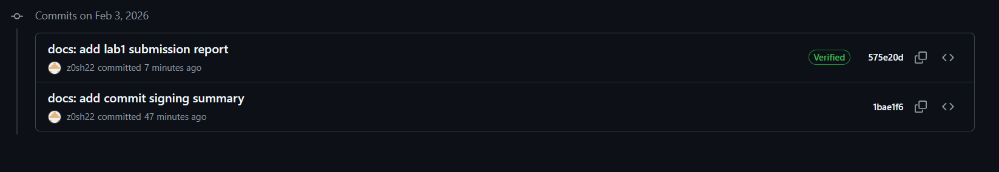

# Отчет по лабораторной работе №1

## 1. Преимущества подписания коммитов
Подписание коммитов обеспечивает **аутентификацию** и **целостность** данных.
*   **Подтверждение авторства:** Гарантирует, что код написал именно владелец приватного ключа, а не злоумышленник, подставивший чужой `user.name` в настройки Git.
*   **Защита от подмены:** Любое изменение кода после подписания сделает подпись недействительной.

## 2. Почему подписание коммитов важно в DevOps?
В процессах DevOps и CI/CD автоматизация играет ключевую роль. Если pipeline автоматически берет код и отправляет его в продакшн, критически важно быть уверенным в источнике этого кода.
Подпись коммитов защищает от атак, когда хакеры внедряют вредоносный код в надежный репозиторий. Системы безопасности могут быть настроены так, чтобы отвергать любые изменения без валидной подписи.

## 3. Подтверждение
### Скриншот Verified статуса на GitHub
**
